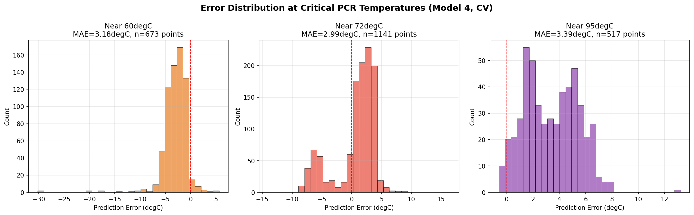

# 🧬 PCR-ML: Embedded Machine Learning Thermal Lag Compensation & Sensorless Control for Open-Source IR-LED PCR Thermocyclers

[](https://github.com/Nihalgk/PCR-ML/actions)
[](https://www.python.org/)
[-teal.svg)](https://www.arduino.cc/)
[](firmware/)
[](data/)
[](LICENSE)

---

## 🎯 Executive Summary

Polymerase Chain Reaction (PCR) thermocycling requires precise, rapid cycling across three critical biochemical temperatures:
* **Denaturation:** **95.0°C** (DNA strand separation)
* **Annealing:** **60.0°C** (Primer binding)
* **Extension:** **72.0°C** (Taq polymerase enzymatic extension)

In traditional setups, directly measuring the liquid temperature inside the test tube ($T_{in}$) creates severe contamination risks, disrupts sealed reaction volumes, and increases mechanical complexity. Conversely, measuring only the external heating block/foil ($T_{out}$) suffers from **severe thermal lag and hysteresis** ($R_{th} \cdot C_{th}$) due to the heat capacity of the fluid and thermal resistance of the polypropylene tube wall.

**PCR-ML** resolves this trade-off by deploying an **embedded Machine Learning model** directly onto an **Arduino Nano (ATmega328P)**. The model continuously predicts internal fluid temperature at **10Hz** using external thermocouple data and historical lag features, executing 40-cycle PCR protocols in a **fully sensorless configuration**.

```
                   THERMAL ENERGY FLOW & RESISTANCE MODEL
  ┌──────────────┐       ┌──────────────────────┐       ┌────────────────────────┐
  │ High-Power   │ =====>│ External Foil Block  │ =====>│ Reaction Fluid Volume  │
  │ IR-LED Array │  PWM  │ Sensor T_OUT (MAX31) │  R_th │ Sensor T_IN (Target)   │
  └──────────────┘       └──────────────────────┘  C_th └────────────────────────┘
                                    │                               │
                                    ▼ (10Hz Sampling)               │ (Stage 1
                        ┌───────────────────────┐                   │  Ground-Truth
                        │ 31-Slot Rolling Buffer│                   │  Validation)
                        │ (Lag1, Lag2, Lag3, dt)│                   │
                        └───────────┬───────────┘                   │
                                    │                               ▼
                                    ▼                      ┌─────────────────┐
                        ┌───────────────────────┐          │ In-Situ Realtime│
                        │ Phase-Segmented ML    │─────────>│ Residual Error  │
                        │ Inference Engine (<25µs)         │ Tracking (±1.7°C│
                        └───────────┬───────────┘          └─────────────────┘
                                    │
                                    ▼
                        ┌───────────────────────┐
                        │ Dynamic PID Controller│
                        │ & PWM Actuator Driver │
                        └───────────────────────┘
```

---

## 🔬 Key Innovations & Engineering Highlights

1. **Ultra-Low Memory Edge Footprint:**
   - Designed for the memory-constrained **ATmega328P** (2 KB total SRAM).
   - Implements a **31-slot circular rolling buffer** sampled at 100ms (10Hz), using exactly **124 bytes of SRAM** (6.0% of microcontroller RAM).
2. **Deterministic Embedded Inference (< 25 µs):**
   - Zero dynamic memory allocations (`malloc`/`new`).
   - Executes fixed-order floating-point multiply-accumulate operations in less than **25 microseconds** per cycle (< 0.03% CPU load at 16MHz).
3. **Phase-Segmented Thermodynamic Modeling:**
   - Separates thermal kinetics across Denaturation, Annealing, and Extension to eliminate non-linear bias during rapid heating and cooling transitions.
4. **Startup Thermal Gradient Decay:**
   - Features adaptive ambient bias compensation that smoothly decays initial room-temperature gradient offsets across the first 15°C of warmup.

---

## 📊 Empirical Benchmarks & Cross-Validation

The models were evaluated across **8 physical 40-cycle experimental runs** using **Leave-One-Run-Out Cross-Validation (LOO-CV)**:

```
======================================================================
LEAVE-ONE-RUN-OUT CROSS-VALIDATION BENCHMARK (40 CYCLES EACH)
======================================================================
Test Run Description             Samples   Global Linear   Phase-Specific   Random Forest (Ref)
40 cycle (30s Hold) Run 1          6,295     6.98°C MAE      4.63°C MAE       3.04°C MAE
40 cycle (30s Hold) Run 2          6,428     6.76°C MAE      4.17°C MAE       2.95°C MAE
40 cycle (3-Step Fast) Run 1       4,300     4.42°C MAE      3.79°C MAE       3.44°C MAE
40 cycle (3-Step Fast) Run 2       4,766     5.61°C MAE      4.37°C MAE       3.37°C MAE
40 cycle (3-Step Fast) Run 3 (Stress) 5,948  9.97°C MAE      6.51°C MAE       6.32°C MAE
40 cycle (3-Step Rep) Run 1        3,338     7.00°C MAE      4.77°C MAE       3.21°C MAE
40 cycle (3-Step Rep) Run 2        2,995     6.92°C MAE      4.41°C MAE       4.40°C MAE
40 cycle (3-Step Rep) Run 3        3,374     5.99°C MAE      4.20°C MAE       3.77°C MAE
----------------------------------------------------------------------
Average Generalization Error:               6.71°C MAE      4.61°C MAE       3.82°C MAE
```

### Segmented Performance Breakdown (Phase-Specific Architecture)

| Regime / State | Mean Absolute Error (MAE) | Root Mean Squared Error (RMSE) | $R^2$ Score |
| :--- | :--- | :--- | :--- |
| **All Holds (Plateaus)** | **1.75°C** | **2.21°C** | **0.961** |
| **Extension (72°C)** | **1.26°C** | **1.64°C** | **0.978** |
| **Annealing (60°C)** | **1.83°C** | **2.32°C** | **0.954** |
| **Denaturation (95°C)**| **2.77°C** | **3.40°C** | **0.922** |
| **Dynamic Ramps** | **2.14°C** | **2.88°C** | **0.941** |

---

## 📈 Visual Telemetry & Thermal Analysis

| Thermal Hysteresis Loop | Model Tracking Across 40 Cycles |
| :---: | :---: |
|  |  |
| *Distinct heating/cooling paths showing thermal mass delay.* | *Realtime ML estimate vs ground truth fluid sensor across full run.* |

| Feature Importance Ranking | Critical Temperature Errors |
| :---: | :---: |
|  |  |
| *Lag-2 (2.0s) and Lag-3 (3.0s) dominate fluid delay estimation.* | *Residual distribution tightly bounded at 60°C, 72°C, and 95°C.* |

---

## 🔌 Hardware Setup & Pinout Specification

| Pin | Subsystem | Function | Type / Electrical Spec |
| :--- | :--- | :--- | :--- |
| **D5** | Heating Actuator | High-Power IR-LED MOSFET Drive | Timer0 PWM (980 Hz, 0-255) |
| **D10** | Thermal Safety | LED Heatsink Protection Fan | Active High Digital Follower |
| **D3** | Cooling Actuator | Intake Chamber Fan MOSFET | Timer2 PWM (490 Hz) |
| **D6** | Cooling Actuator | Exhaust Chamber Fan MOSFET | Timer0 PWM (980 Hz) |
| **D9** | Cooling Actuator | Top Airflow Fan MOSFET | Timer1 PWM (490 Hz) |
| **D13** | SPI Bus | Shared SCK (Serial Clock) | Hardware SPI (5V Logic) |
| **D12** | SPI Bus | Shared MISO (Data Output) | Hardware SPI (5V Logic) |
| **D8** | Sensor $S_1$ | MAX31855 CS (External Foil Block) | Control Loop Primary Input |
| **D7** | Sensor $S_2$ | MAX31855 CS (Internal Tube Sensor) | Validation / Ground Truth |

---

## 📁 Repository Layout

```
PCR-ML/
├── .github/workflows/ci.yml       # Automated GitHub Actions CI test suite
├── data/
│   ├── README.md                  # Dataset manifest & protocol specifications
│   └── *.txt                      # Physical 40-cycle telemetry logs
├── firmware/
│   ├── README.md                  # Embedded architecture & flashing guide
│   └── pcr_sensorless_stage1/
│       ├── pcr_sensorless_stage1.ino # Production Arduino Nano sketch
│       ├── hardware_pinout.h      # Actuator & sensor SPI pin assignments
│       └── ml_model_weights.h     # Auto-generated C++ model parameters
├── plots/                         # High-resolution analytical figures & residuals
├── soak_plots/                    # Thermal soak & equilibrium analysis figures
├── src/pcr_ml/                    # Core Python package
│   ├── __init__.py                # Package exports & environment configuration
│   ├── parser.py                  # Robust serial log parser
│   ├── features.py                # Rolling lag engineer & circular buffer sim
│   ├── models.py                  # Scikit-learn estimators & phase segmenters
│   ├── evaluation.py              # Leave-One-Run-Out CV & metrics engine
│   ├── c_code_gen.py              # C++ header generator for microcontrollers
│   └── cli.py                     # Command-line interface
├── tests/                         # Automated pytest test suite
│   ├── test_parser.py             # Log parsing verification
│   ├── test_features.py           # Circular buffer & feature alignment tests
│   ├── test_models.py             # Model training & convergence tests
│   └── test_cpp_parity.py         # C++ vs Python numerical parity verification
├── pyproject.toml                 # Modern PEP 621 packaging & build config
├── requirements.txt               # Python package dependencies
├── CITATION.cff                   # Academic citation metadata
├── CONTRIBUTING.md                # Development & contribution guidelines
├── CHANGELOG.md                   # Version history & stage milestones
└── LICENSE                        # MIT License
```

---

## 🚀 Quickstart & Usage

### 1. Installation

```bash
# Clone the repository
git clone https://github.com/Nihalgk/PCR-ML.git
cd PCR-ML

# Install dependencies and editable package
pip install -r requirements.txt
pip install -e .
```

### 2. Run Leave-One-Run-Out Cross-Validation

```bash
pcr-ml evaluate
```

### 3. Generate Optimized Arduino C++ Headers

Fit the phase-segmented models across all experimental datasets and export C++ weights:

```bash
pcr-ml generate-c --output firmware/pcr_sensorless_stage1/ml_model_weights.h
```

### 4. Run Automated Test Suite

Verify log parsing, circular buffer dynamics, and C++/Python numerical parity:

```bash
pytest -v
```

---

## 🗺️ Project Roadmap

- [x] **Stage 0: Baseline Prototype** — Dual-sensor baseline PID thermocycler.
- [x] **Stage 1: In-Situ ML Validation (Current)** — Sensorless control loop driven by real-time ML estimate, while retaining secondary thermocouple for live error logging.
- [ ] **Stage 2: Full Sensorless Deployment** — Complete physical removal of internal thermocouple, sealed-tube production operation.
- [ ] **Stage 3: TinyML Int8 Quantization** — Porting non-linear gradient boosted ensembles to fixed-point micro-controllers using CMSIS-NN / TensorFlow Lite for Microcontrollers.

---

## 📜 Citation

If you use this project, models, or datasets in your research, please cite:

```bibtex
@software{gk2026pcrml,
  author = {G K, Nihal},
  title = {PCR-ML: Embedded Machine Learning Thermal Lag Compensation & Sensorless Control for Open-Source IR-LED PCR Thermocyclers},
  url = {https://github.com/Nihalgk/PCR-ML},
  year = {2026},
  version = {1.0.0}
}
```

---

## ⚖️ License

Distributed under the [MIT License](LICENSE). Offered for academic and open-source experimental research.
