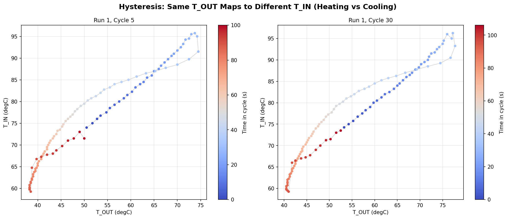
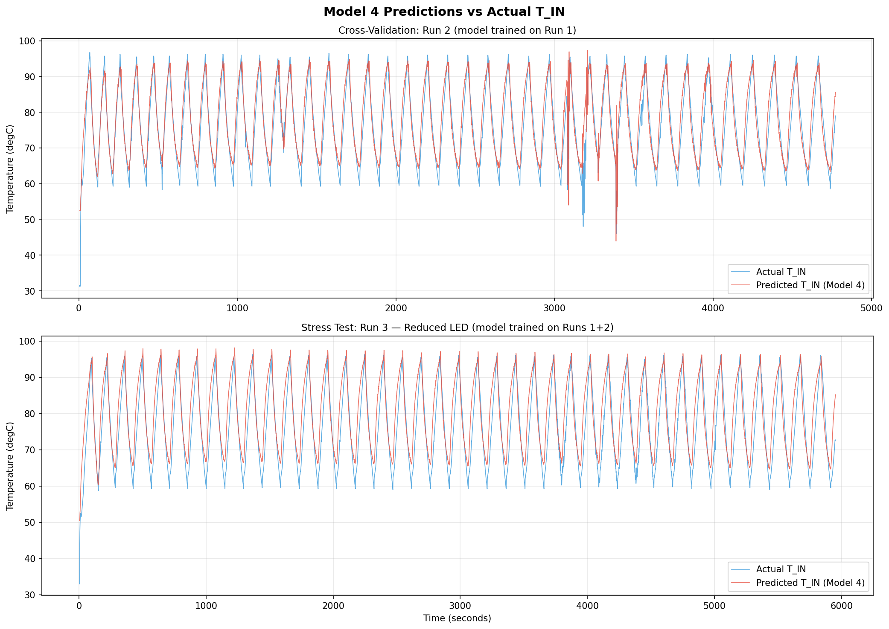
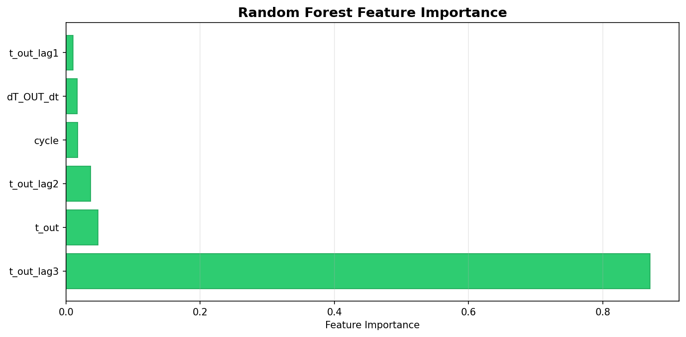

# 🧬 PCR-ML: Sensorless Thermal Control for IR-LED PCR

Welcome to **PCR-ML**, a machine learning-based control architecture for an open-source IR-LED Polymerase Chain Reaction (PCR) thermocycler. 

This repository contains the dataset, Python analytical scripts, and the Stage 1 Arduino Nano firmware for transitioning the PCR machine from a dual-sensor setup to a **sensorless control** configuration.

## 🎯 Project Overview

In traditional PCR devices, directly measuring the temperature of the fluid inside the test tube (`T_IN`) is problematic because it introduces contamination risks and requires complex physical setups. Measuring the temperature of the external heating block (`T_OUT`) is easier, but it suffers from severe **thermal lag (hysteresis)** — the block heats up and cools down much faster than the fluid inside the tube.

### The Solution
Instead of directly measuring `T_IN` during operation, this project uses a **Machine Learning Model (Linear Regression with historical lag features)** embedded directly onto an **Arduino Nano** to predict the fluid's internal temperature in real-time, based solely on the external foil block's temperature sensor.

*   **T_OUT + ML = Control:** The PID loop, target crossing detection, and hold timings are driven entirely by the ML model's estimation.
*   **Validation:** During Stage 1 (current), the physical `T_IN` thermocouple remains connected **only** for validation, error logging, and performance comparison.

## 🧠 The Machine Learning Model

The core challenge was modeling the hysteresis between the fast-heating IR LED block and the slower-heating fluid volume.

*Above: The distinct heating and cooling paths demonstrate the thermal lag challenge between the external block and internal fluid.*

To solve this, we collected extensive 40-cycle test runs and trained several models. The chosen architecture is a **Rolling-History Linear Regression** model that considers:
1.  **Current T_OUT**
2.  **Rate of Change (dT/dt)**
3.  **Historical Lags (1s, 2s, and 3s delays)**
4.  **Cycle Count (Micro-drift compensation)**

### Real-time Implementation
To run on a memory-constrained Arduino Nano (2KB RAM), the firmware implements a highly efficient **30-sample circular buffer** that updates every 100ms. This rolling buffer uses only ~120 bytes of RAM and allows for perfectly smooth, continuous ML temperature estimation to feed the PID loop.

## 📊 Performance & Validation

The model handles rapid thermal cycling (95°C Denaturation ↔ 60°C Annealing ↔ 72°C Extension) seamlessly. 

*Above: The ML model accurately tracks the true internal temperature across all 40 PCR cycles.*

*Above: Analysis showed that the 2s and 3s historical lags are the most critical features for predicting the thermal mass delay.*

**Key Metrics:**
*   **Mean Absolute Error (MAE):** ~2.3°C
*   **PID Stability:** 100ms continuous sampling ensures smooth derivative response, preventing heater spiking.
*   **Stage 1 Success:** The system is ready to reliably execute full 40-cycle PCR protocols using purely sensorless predictions.

## 📂 Repository Structure
*   `PCR_3step_PWM.ino` - The Stage 1 Sensorless Arduino Nano Firmware.
*   `*.txt` - Raw serial output logs from physical thermal cycling tests.
*   `pcr_calibration_analysis.py` - Core data cleaning, model training, and performance validation script.
*   `analyze_thermal_soak.py` - Analysis script for determining equilibrium delays.
*   `plots/` - Generated performance graphs, residuals, and hysteresis loops.

## 🚀 Next Steps
Once the Stage 1 validation confirms acceptable error bounds across varying ambient conditions, the physical `T_IN` thermocouple will be permanently removed (Stage 2), resulting in a cheaper, simpler, and fully sensorless PCR architecture!

## ⚖️ Disclaimer & Usage Rights

**Notice:** This repository and its contents are part of a personal, independent laboratory research project. 

All hardware designs, firmware code, dataset logs, machine learning models, and analytical scripts presented here are original intellectual property. **Please do not copy, reproduce, distribute, or use this data or code for commercial or academic purposes without explicit prior permission.** 

This project is shared publicly for portfolio and demonstration purposes only. The provided code is offered "as-is" without any warranties regarding its safety or efficacy in a clinical or diagnostic setting.
